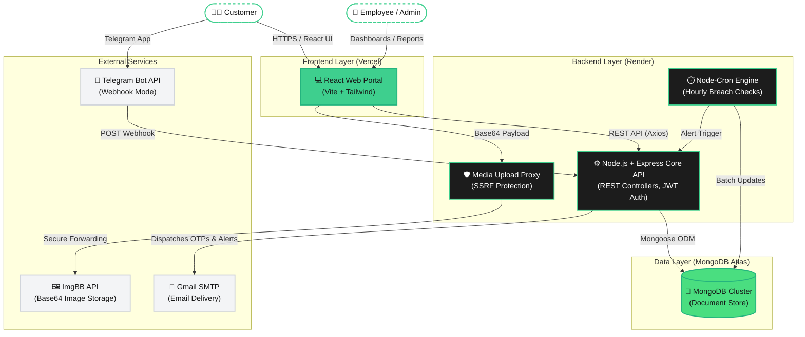
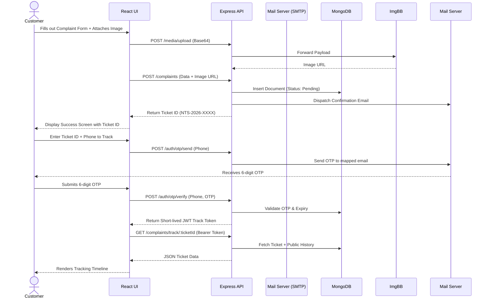
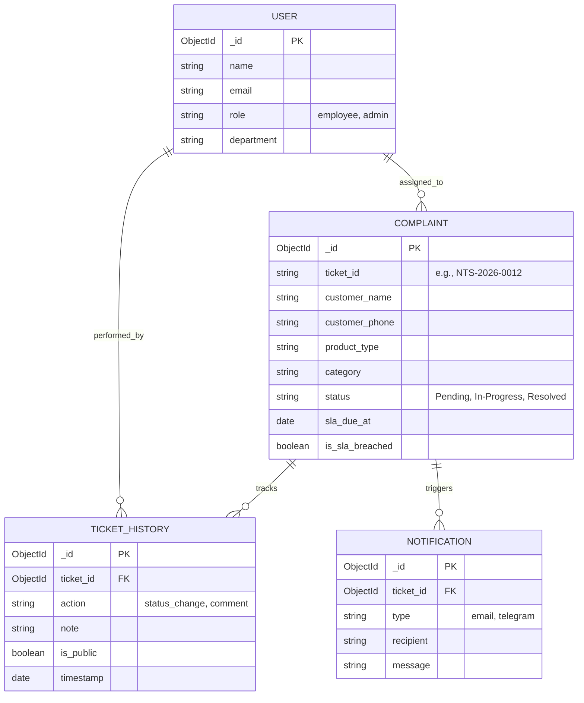

# System Architecture & Technical Specifications

This document provides an exhaustive, multi-layered breakdown of the technical architecture for the Nature Tek Solar Customer Grievance Management System (CGMS). It details the macro-level system interactions, data flow models, and the security boundary implementations.

---

## 1. High-Level Macro Architecture

The core architecture follows a decoupled, three-tier model (Client, Server, Database) augmented by external SaaS integrations for specialized tasks (image hosting, email delivery, conversational bots).

---

## 2. Authentication & Data Flow (Sequence)

The following sequence diagram illustrates the typical lifecycle of a customer filing a complaint and checking its status using the secure OTP fallback method.

---

## 3. Core Database Schemas (ER Model)

The database utilizes a highly normalized schema for strict history auditing, paired with embedded subdocuments for performance where appropriate.

---

## 4. Component Breakdown & Security Posture

### 4.1 Frontend Layer (Vercel)
- **Framework:** React.js + Vite.
- **State & Sync:** Managed via Custom Hooks wrapping Axios requests, with `React Hot Toast` for transient state feedback.
- **Resource Optimization:** The `NotificationBell` component utilizes the `document.visibilityState` API. If the user minimizes the tab, polling halts entirely, cutting idle backend bandwidth by over 90%.

### 4.2 Backend Layer (Render)
- **Security Boundary:**
  - **Upload Proxy (`/v1/media/upload`):** Prevents exposure of external API keys. Validates base64 signatures to ensure the payload is actually an image (PNG/JPEG/WEBP) and blocks SSRF vectors.
  - **NoSQL Injection Guard:** Enforces strict type-casting in critical controllers (e.g., `auth.controller.js`) preventing object-injection (`$ne`, `$gt`) bypasses.
  - **Mass Assignment:** Uses Mongoose `{ runValidators: true }` paired with explicit object destructuring to ensure employees cannot arbitrarily alter restricted fields (like `customer_phone` or `sla_due_at`).

### 4.3 Data Layer (MongoDB Atlas)
- **Indexing Strategy:** 
  - Unique Index on `ticket_id` for O(1) lookups.
  - Compound Index on `{ ticket_id: 1, timestamp: -1 }` inside `TicketHistory` to rapidly construct timelines.
  - Index on `{ status: 1, is_sla_breached: 1 }` to ensure the Node-Cron SLA checker completes in milliseconds, even with thousands of open tickets.

### 4.4 External Integrations
- **Telegram Bot:** Operates entirely over secure Webhooks rather than long-polling. Prevents double-processing and reduces overhead. Incorporates primitive keyword-matching auto-categorization.
- **ImgBB:** Headless image hosting. Storage URLs are embedded directly into the MongoDB document arrays. 
- **Nodemailer:** Utilizes a generic SMTP transport layer, designed to be hot-swappable to SendGrid or Amazon SES when scaling is required.
