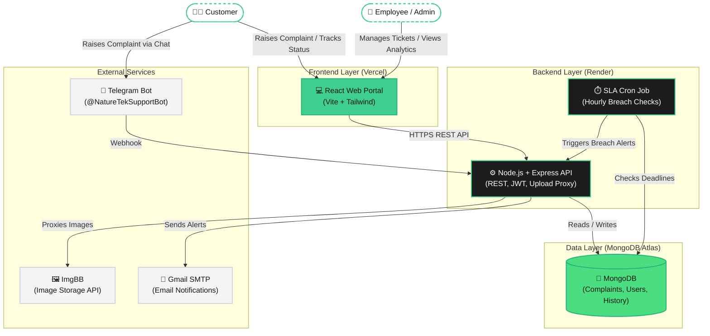

# System Architecture

This document provides a detailed breakdown of the technical architecture for the Nature Tek Solar Customer Grievance Management System (CGMS).

## High-Level Architecture Diagram

## Component Breakdown

### 1. Frontend Layer (Client)
- **Framework:** React.js powered by Vite for rapid compilation.
- **Styling:** Tailwind CSS, utilizing a specific design system centered around an Emerald primary color (`#3ecf8e`).
- **Hosting:** Hosted on Vercel (`grievance.natureteksolar.com`).
- **Core Views:**
  - **Public:** Customer Portal (complaint registration) and OTP-based Ticket Tracker.
  - **Internal:** Employee Dashboard (assigned tickets) and Admin Dashboard (routing, SLA config, analytics).
- **Optimization:** Utilizes the Page Visibility API to pause long-polling API calls (like notification checks) when the browser tab is hidden to save server bandwidth.

### 2. Backend Layer (Server)
- **Framework:** Node.js with Express.
- **Security:** 
  - JWT Authentication for secure role-based access.
  - Strict input sanitization against NoSQL injection.
  - Image Upload Proxy (`/v1/media/upload`) that hides the ImgBB API key from the frontend and accepts base64 payloads securely.
  - Path Traversal prevention on Telegram webhooks.
- **SLA Engine:** A background `node-cron` job running continuously to flag tickets that have breached their designated Service Level Agreement deadlines.

### 3. Data Layer (Database)
- **Database Engine:** MongoDB hosted on MongoDB Atlas.
- **Schemas:** 
  - `User` (Staff authentication and workload tracking).
  - `Complaint` (The master ticket model carrying customer data, status, and SLA).
  - `TicketHistory` (An immutable audit trail of all actions and comments applied to a ticket).
  - `Notification` (Stores all alerts dispatched to users).
- **Optimization:** Compound indexes applied to `TicketHistory` and `Notification` to ensure sub-millisecond retrieval speeds for the dashboards.

### 4. External Services & Integrations
- **Telegram Bot:** A dedicated automated channel allowing users to register and track complaints via their phones seamlessly.
- **ImgBB:** A cloud image storage proxy used to host customer evidence (cracked panels, error codes on inverters).
- **SMTP Notification Pipeline:** Integrated Nodemailer for dispatching OTP verification emails and automated status updates to customers.
